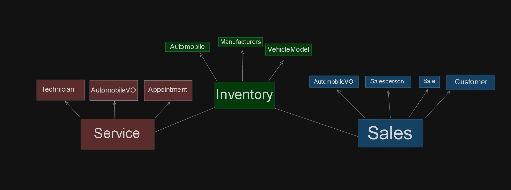

# CarCar

Team:

* Jerry Kuo - Sales
* Alvin Mach - Service

## How to Run The Project

1. Both members will clone the same repository to their local computers accessing through this link
    https://gitlab.com/machalvin02/project-beta.git
2. Use the command in your terminal
    ```
    git clone https://gitlab.com/machalvin02/project-beta.git
    ```
3. Change your working directory to newly clone directory
    ```
    cd project-beta
    ```
4. For the next set up you will need to have docker installed onto your computer
    https://docs.docker.com/engine/install/
5. Select the right platform for your setup.
6. Once you have docker configured, both partner will run the following command
    ```
    docker volume create beta-data
    docker-compose build
    docker-compose up
    ```
7. Access the application at http://localhost:3000/
#### Relevant URLs:

| Feature          | URL          |
|------------------|--------------|

###### Manufacturers
|List Manufacturers   | http://localhost:3000/manufacturers/        |
|Create Manufacturers | http://localhost:3000/manufacturers/create/ |

###### Models
|List Models   | http://localhost:3000/models         |
|Create Models | http://localhost:3000/models/create/ |

###### Automobiles
|List Automobiles   | http://localhost:3000/automobiles/        |
|Create Automobiles | http://localhost:3000/automobiles/create/ |

###### Salespeople
|List Salesperson   | http://localhost:3000/salespeople/        |
|Create Salesperson | http://localhost:3000/salespeople/create/ |

###### Customers
|List Customer   | http://localhost:3000/customers/        |
|Create Cusotmer | http://localhost:3000/customers/create/ |

###### Sales
|List Sales   | http://localhost:3000/sales/        |
|Create Sales | http://localhost:3000/sales/create/ |

###### Salesperson History
|List Salesperson History | http://localhost:3000/sales/history/ |

###### Technician
|List Technician   | http://localhost:3000/technicians/     |
|Create Technician | http://localhost:3000/technicians/new/ |

###### Service Appointments
|List Appointments   | http://localhost:3000/appointments/        |
|Create Appointments | http://localhost:3000/appointments/create/ |

###### Service History
|List Service History | http://localhost:3000/appointments/history/ |


## Design



## Service microservice
I created 3 models which are Technician, AutomobileVO, and Appointment.
The Technician model hold information of each technicians, including their first name, last name, and their own unique employee ID. The employee ID is important because we use it to identify a specific employee.
The AutomobileVO model represents all of the vehicles in our system, which can be identified by their unique vehicle identification number which is known as vin. It will also let us know whether a vehicle has been sold or not.
The Appointment model is used to schedule appointments. Appointment model stores the date and time of the appointment, the reason for service, its current status, their vin, reason for service, and whether or not they are VIP customers. This connects to the Technician model using a foreign key. With the Foreign key I am amble to connect each appointment to any technician I pick.
For the functionality side of the inventory microservice, the microservice keeps track of technicians, service appointments, and vehicles. Overall, it makes the inventory system very organized.

## Service poller

For my poller.py file I wanted to retrieve automobile data. I created a function called get_auto that sends a gret request to a specific URL that has the automobile information. For each automobile, I use update_or_create to update an entry that exist already or create a new one based on the vin. The polling will keeping looping to retrieve any data process. I added a 60 second pause between the iteration.

## Sales microservice

For the sales microservice, in the back-end I added the app 'sales_rest.apps.SalesRestConfig' and 'corsheaders' and 'corsheaders.middleware.CorsMiddleware' to the settings.py of 'sales_project' to ensure the app runs and to make sure no CORS errors were encountered. Next I created models for Salesperson (which has properties: first name, last name, employee ID), Customer (properties: first name, last name, address, phone number), AutomobileVO (properties: vin, sold), and Sale (properties: price, automobile, salesperson, customer) with Sale needing foreign keys to acces Salesperson, Customer, and AutomobileVO. In Docker, under containers, I navigated to the terminal of sales-api-1 and ran my migrations. Since automobiles are located inside of the inventory api, I needed an automobile value object to grab data from there, thus the AutomobileVO was created. To grab that data however, I needed to implement a poller to get said data. Next the views were created to get, post, and delete salespeople, customers, and sales. To test if these are working, Insomnia was used using the following RESTful API calls:

#### RESTful API calls:

| Feature          | Method          | URL          |
|:-----------------|:----------------|:-------------|


###### Salespeople
|List Salesperson   | GET    | http://localhost:8090/api/salespeople/ |
|Create Salesperson | POST   | http://localhost:8090/api/salespeople/ |
|Delete Salesperson | DELETE | http://localhost:8090/api/salespeople/ |


###### Customers
|List Customer   | GET    | http://localhost:8090/api/customers/ |
|Create Cusotmer | POST   | http://localhost:8090/api/customers/ |
|Delete Customer | DELETE | http://localhost:8090/api/customers/ |

###### Sales
|List Sales  | GET    | http://localhost:8090/api/sales/ |
|Create Sale | POST   | http://localhost:8090/api/sales/ |
|Delete Sale | DELETE | http://localhost:8090/api/sales/ |
